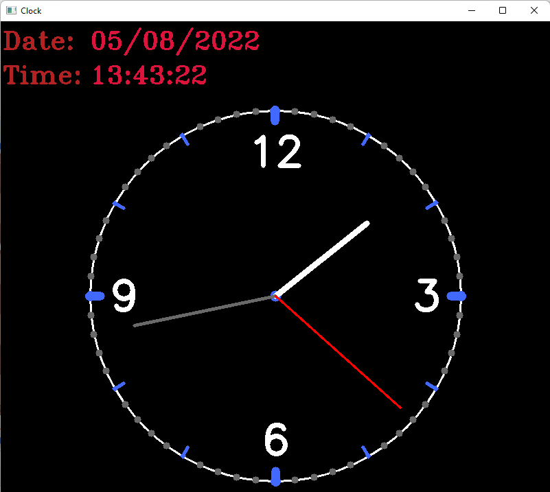

# Analog-Clock

## Libraries
OpenCV \
numpy \
math \
time \
datetime

## Commands to download Libraries
pip install numpy \
pip install opencv-python 

# Notice
you can close app window by press 'q'

## Screenshot

